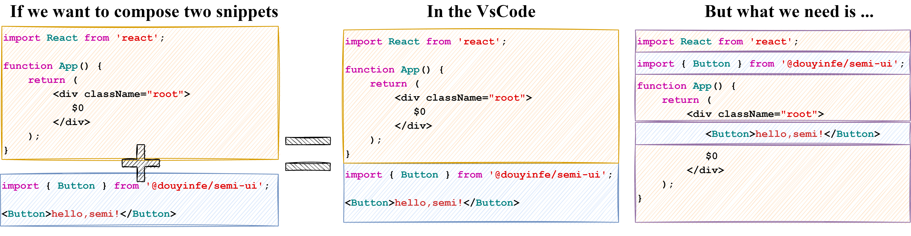
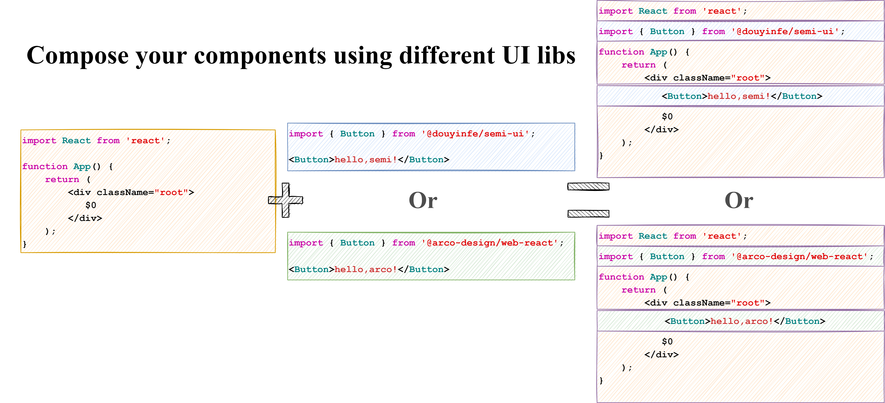

# snippet-composer：给代码片段加点魔法

## 导读

snippet 在软件工程领域可译为**代码片段**，虽然你可能很少有机会编写它，但你一定会在代码编辑器上使用过它。它要么直接集成到编辑器中，要么以插件的形式来进行扩展。就以笔者经常使用的 vscode 为例，在做网页开发时，会安装`HTML Snippets`、`Javascript Snippets`等插件，如果使用到框架还会安装框架对应的插件，这些插件内置的代码片段可以极大提高开发效率。

> “你可能没有自己编写过代码片段但是你一定享受过代码片段带来的便利性。”


本文以 vscode 为例，指出了代码片段在 vscode 中应用的局限性，即代码片段与代码片段之间没有建立联系，它们是**相对孤立**的，这导致了当需要编写更复杂更贴近实际业务的代码片段时会遇到困难，而后为了解决这一问题，笔者设计实现了一个用于组合代码片段的工具包：snippet-composer。

## vscode 中的 snippet

下面，我们将简要介绍一下 vscode 中代码片段的相关概念和用法，这里只介绍本文提及的部分概念，详细的说明参见[官方文档](https://code.visualstudio.com/docs/editor/userdefinedsnippets)。

- 基本语法，vscode 中的代码片段语法遵循 [TextMate snippet 语法](https://manual.macromates.com/en/snippets) ，但是不支持执行内置的 shell 代码和`\u`的用法。 一个代码片段可以使用一个`json`格式的文件来描述，其键为代码片段的名称，值为描述代码片段的对象。其中必选字段`prefix`对应了代码片段的触发词；必选字段`body`是代码片段的主体内容，其值可以为字符串或数组，数组中每个元素对应一行代码；可选字段`description`用于描述代码片段；可选字段`scope`为代码片段的作用域。

```json
// in file 'Code/User/snippets/javascript.json'
{
    "For Loop": {
        "prefix": ["for", "for-const"],
        "body": ["for (const ${2:element} of ${1:array}) {", "\t$0", "}"],
        "description": "A for loop.",
        "scope": "javascript,html"
    }
}
```
- Tabstops，可译为制表位，决定了在插入代码片段后光标在片段中停留的位置，若有多个制表位可以使用编号排序，通过 Tab 键来切换制表位，在用户输入内容时编号相同的制表位会被同步更新。其语法为`$1`，`$2`，也可给定默认值和可选值，如`${1:another ${2:placeholder}}`，`${1|one,two,three|}`。`$0`较为特殊，它决定了最终光标的位置。

- 变量，语法为`$name`或 `${name:default}`，只能使用 vscode 预定义的变量，如，

>- `TM_SELECTED_TEXT `当前选中的文本或空字符串
>- `TM_CURRENT_LINE `当前行的内容
>- `CURRENT_SECONDS_UNIX `自 Unix 纪元以来的秒数
>- `RANDOM` 6 个随机 Base-10 数字
>- `BLOCK_COMMENT_START `示例输出：PHP`/*`或 HTML`<!--`


## 造个轮子给 snippet 加点魔法

### 业务背景

在介绍轮子之前，我们先讨论一下有没有这样一些场景需要将多个代码片段组合成一个更大的代码片段从而用于描述一个组件或页面模板。

**场景一**：在开发业务组件开发时，已有一个用于描述通用 react 函数组件的代码片段，一个与业务紧耦合的全局 context 的代码片段，我们需要组合成一个可随主题切换的业务组件代码片段。

```jsx
/************* React 通用函数组件 snippet *************/
import React from 'react';

const $1 = () => {
  return (
    <div> $1 </div>
  )
}
export default $1

/************* 全局主题 context snippet *************/

import ThemeContext from '@/context';
const theme = useContext(ThemeContext);

/************* 组合为一个带全局主题的业务组件 *************/

import React from 'react';
import ThemeContext from '@/context';

const $1 = () => {
  const theme = useContext(ThemeContext);
  return (
    <div> $1 </div>
  )
}
export default $1
```

**场景二**：在开发中后台页面时，已有一个代码片段用于描述通用页面布局的 react 函数组件，若干个代码片段分别对应不同业务逻辑的`header`、`footer`和`menu`组件，需要组合成任意数量业务逻辑有差异的中后台页面模板。

```jsx
/************* 页面布局 React 函数组件代码片段 *************/
import React from 'react';
import Layout from '@/Layout';

const $1 = () => {
  return (
    <Layout> $0 </Layout>
  )
}
export default $1
/************* 一些构成页面的组件代码片段 *************/
// 1. header snippet
import React from 'react';
const $1 = () => {
  return (
    <header> $0 </header>
  )
}

// 2. footer snippet
import React from 'react';
const $1 = () => {
  return (
    <footer> $0 </footer>
  )
}

// 3. menu snippet
import React from 'react';
const $1 = () => {
  return (
    <aside> $0 </aside>
  )
}

/************* 组合为一个页面模板 *************/
import React from 'react';
import Layout from '@/Layout';

const $1 = () => {
  return (
    <Layout>
      <header> $2 </header>
      <footer> $3 </footer>
      <aside> $4 </aside>
    </Layout>
  )
}
```

**场景三**：在白盒测试时，需要根据文档规定流程进行测试，其中可能包含大量重复的测试逻辑和少量与当前业务相关的逻辑代码，文档中每个测试环节都可以用若干个代码片段描述。（下述示例表示的`$Host、$User、$PassWord、$DB`为自定义变量，原生代码片段没有提供自定义变量的能力）

```javascript
/************* 连接数据库代码片段 *************/
import mysql from mysql;
const connection = mysql.createConnection({
  host     : $Host,
  user     : $User,
  password : $PassWord,
  database : $DB
});
connection.connect();

/************* 断言库与断言代码片段 *************/
import assert from 'node:assert';
connection.query('.....', (err, result) => {
    assert(result,'it should be true');
});
$0
/************* 组合为完整的测试流程代码片段 *************/
import mysql from mysql;
import assert from 'node:assert';

const connection = mysql.createConnection({
  host     : $Host,
  user     : $User,
  password : $PassWord,
  database : $DB
});
connection.connect();
connection.query('.....', (err, result) => {
    assert(result,'it should be true');
});
$0
```

以上提到的场景中，vscode 及其插件都没有提供相应的组合能力。

当然，有人会说，那我自己把这些代码片段通过 cv 大法手动组合起来不就完事了，这不需要借助任何工具。其实这纯粹是一个选择问题，如果你使用的代码片段之间不需要建立组合关系，或者代码片段不需要按细粒度划分且几乎不随业务变化，那么完全不需要再额外使用工具包。

那么，在组合代码片段时，我们需要考虑哪几方面的问题呢？

1. 对代码片段各个部分**重新排序后再组合**。
2. 重组后的代码片段需要对 tabstops **重新编号**。
3. 其他**拓展功能**。

### 组合多个代码片段

首先，我们回顾一下当代码片段没有提供组合能力时，直接手动拼接多个代码片段得到的结果往往和预期有差异。



上图表明，如果想要得到预期的代码，不能只是简单的做加法，而是需要对代码片段中的代码重新排列组合。

当然，除了两两组合外，我们还可以从组合思想出发，更进一步地细化代码片段的粒度，提高复用性。比如，在一个页面模板中，根据业务需要组合不同组件库的组件从而生成不同的页面模板。



### 对 tabstops 重新编号

在重新组合代码片段后，大多数情况下都要对原有的 tabstops 进行重新编号。比较极端的编号规则有两种，一是所有 tabstops 都不变，二是按出现顺序对序号进行递增。正所谓众口难调，为了减少不必要的误解并简化逻辑。笔者的设计方案是，在组合代码片段后默认 tabstops 的编号不变，但是用户可以通过拓展字段来对组合后的 tabstops 重新编号，具体可参考下面的用法。

### 自定义变量

虽然 vscode 提供的代码片段能力不像原生的 [TextMate 语法](https://manual.macromates.com/en/snippets) 支持 shell 代码内联，但是提供了一些预置的变量，这些变量大多数用来提供一些上下文信息。但是却没有提供用户自定义变量的能力。因此，我们可以在设计代码片段组合能力的时候，可以顺便提供一些简单的用户自定义变量的能力。

当然，自定义变量的能力是受限的，如果要修改变量的值，需要重新生成代码片段，没法在插入代码片段的时候动态计算变量值。因此，它更加适合一定时段内相对不变的常量。不过，它依然能有很多待发掘的潜力，比如用于快速统一或切换代码风格或命名风格，读取 git 配置将作者信息写入到代码注释中。

### 食用方法

下面，我们将对上面提出的三大功能点：**组合**，**编号**和**自定义变量**，进行逐一演示。

遵循自上而下设计的原则，我们先对工具包的入口函数展开讨论。

入口函数命名为`defineSnippet`，需要传入的函数变量有两个，第一个参数传入拓展的代码片段，它在继承了原生代码片段相关字段的基础上拓展了一些字段，第二个变量为一个数组，它存放了需要组合的原生代码片段。最后返回的结果为经组合后新的代码片段。

首先我们放出一个完整的示例程序，然后再逐条介绍示例中涉及到的拓展字段与语法。

```javascript
/************* snippet1.json *************/
{
      mysql: {
        prefix: ['ms'],
        body: [
          'import mysql from mysql',
          'mysql.connect($USER_NAME,$USER_PASSWORD,$1);',
        ],
      },
      assert: {
        prefix: ['as'],
        body: [
          'import assert from assert',
          'assert(a,1);\rassert(b,$1);\rassert(c,$2);',
          '$0',
        ],
      },
}
/************* snippet2.json *************/
{
      utils: {
        prefix: ['utils'],
        body: [
          'function delay() {\r\tsleep($1);\r}',
          'function getPort() {\r\treturn ${2};\r}',
        ],
      },
}

/************* index.js *************/
import snippet1 from "./snippet1.json";
import snippet2 from "./snippet2.json";

const newSnippet = defineSnippet(
    // 参数一为拓展的代码片段，主要负责组合原生代码片段
    {
        'Test Case': {
            prefix: ['tc'],
            description: 'Test Case',
            scope: 'javascript',
            // 重组 snippet1 和 snippet2 的代码片段
            body: [
                '${mysql[0]}',
                '${assert[0]}',
                '${mysql[1]}\r${assert[1,3]}',
                '${utils[0,]}',
            ],
            // 拓展字段
            extra: {
                tabstops: {
                    1: ['mysql$1', 'utils$2'],
                    2: ['assert$1'],
                    3: ['assert$2'],
                    4: ['utils$1'],
                },
                customVar: {
                    USER_NAME: 'admin',
                    USER_PASSWORD: () => '123',
                },
            },
        },
    },
    // 参数二，传入原生代码片段
    [snippet1, snippet2],
);

// 最终组合的结果为原生代码片段
expect(newSnippet).toEqual({
    'Test Case': {
        prefix: ['tc'],
        description: 'Test Case',
        body: [
            'import mysql from mysql',
            'import assert from assert',
            'mysql.connect(admin,123,$1);\rassert(a,1);\rassert(b,$2);\rassert(c,$3);\r$0',
            'function delay() {\r\tsleep($4);\r}\rfunction getPort() {\r\treturn ${1};\r}',
        ],
    },
});
```

1. 为了将不同代码片段的`body`部分进行重组，我们定义了表示`body`元素的语法为`${代码片段名[body索引值]}`，同时还支持部分切片语法。

```javascript
// snippet.json
{
    foo: {
        prefix: ['foo'],
        body: [
          'line0',
          'line1',
          'line2',
        ],
    },
}

// body replace result

'${foo[0]}' -> 'line0'
'${foo[0,1]}' -> 'line0\tline1'
'${foo[1,]}' -> 'line1\tline2'

```

2. 为了对代码片段的 tabstops 编号，我们拓展了字段`extra.tabstops`，其语法为`{新编号:[代码片段名称$body索引值]}`

```javascript
// snippet.json
{
    foo: {
        prefix: ['foo'],
        body: [
          'foo code $1',
          'foo code $2',
        ],
    },
    bar: {
        prefix: ['bar'],
        body: [
          'bar code $1',
          'bar code $2',
        ],
    }
}
// tabstops demo
{
	....
    body:['${foo[0]}','${foo[1]}','${bar[0]}','${bar[1]}'],
    extra: {
        tabstops:{
            2:['foo$2','bar$1'],
            3:['bar$2'],
        }
    }
}
```
```diff
// Compose bodies, and then the new bodies are as follows after replacing tabstops.
body: [
    'foo code $1',
    'foo code $2',
-   'bar code $1',
+   'bar code $2',
-   'bar code $2',
+   'bar code $3'
]
```


3. 最后，拓展字段`extra.customVar`负责管理自定义变量的计算逻辑，其语法为`$自定义变量名`。

```javascript
/************* snippet.json *************/
{
      mysql: {
        prefix: ['ms'],
        body: [
          'import mysql from mysql',
          'mysql.connect($USER_NAME,$USER_PASSWORD,$1);',
        ],
      },
}
// customVar demo
{
    .....
    extra: {
        customVar: {
            USER_NAME: 'admin',
            USER_PASSWORD: () => '123',
        },
    }
}

'mysql.connect($USER_NAME,$USER_PASSWORD,$1);' -> 'mysql.connect(admin,123,$1);'
```

**补充说明：**由于 snippet-composer 的入口函数`defineSnippet`是一个纯函数，因此在实际使用中还需要根据宿主环境提供的文件接口将生成的代码片段写到文件中。[CodeSanbox上](https://codesandbox.io/s/snippet-composer-example-b4klip?file=/src/index.js)给出了在不依赖文件系统时的演示样例，而[github上的样例](https://github.com/ascodelife/snippet-composer/tree/master/example)给出了当宿主环境为 nodejs，编辑器为 vsocde 时，将生成的代码片段写入到项目根目录的示例代码。

### 改进方向

- 易用性：在产品投入市场前，任何产品形态都只是开发者的一厢情愿，前期开发精力最应投入到其易用性的改造上。当然，围绕工具包的生态环境构建也是保证易用性非常重要的一环，比如提供`Code2Snippet、Snippet2Doc、Doc2Snippet、ExtractSnippet `等能力。

- 可视化：笔者比较推崇的一种思想是，将一切效能工具可视化，这也是规范流程的一种方式。只是，提供可视化能力往往需要付出比其自身更高的开发和维护成本，并且优秀的可视化方案本身就是凤毛麟角。

- 性能方向：作为一个对环境零依赖的工具包，可以选择使用更高效的编程语言来重写它，如 c++、rust。但前提是这个工具包确实在大规模场景下遇到了性能瓶颈，否则大概率会浪费人力与提高社区维护成本（从编程语言学习曲线和人数上看）。

## 从具体代码实现的维度浅谈团队规范

在前端开发领域，现在各个大厂都在面向开发者火拼组件库和脚手架。其中，一些组件库还开放了物料市场以及定制化的组件包发布能力。

在笔者看来，组件库规范了交互逻辑和设计风格，脚手架规范了开发环境、编码风格和研发链路。而本文想做的事情，其实是做好具体业务代码实现上的规范，而 snippet-composer 只是这个想法的一个最低成本的载体。

对具体实现代码的规范极有可能是一个伪需求，这是因为一是业务代码极其灵活多变，二是规范本身伴随着成本，规范越细化执行和维护成本越高。在大厂里，由于每个人的编程能力都较高且都具备独立思考能力，再加上有完整的基建支持，所以过度规范反而约束了创造力。

那么笔者为什么还要做这件事？

有两个出发点，第一个源于自身经历，在笔者实习时，接触到的项目是一个已经迭代为巨无霸的中台项目。该项目的主要特点为， 业务组件多且同类型的组件经常重名；当使用 context 来管理 react 组件的数据流时，context 也经常重名，需要不停回溯到父组件才能知道具体引用了哪个 context；引入同类型的工具库增大产物体积，提高了项目维护的潜在风险，如 A 页面使用 moment.js 而 B 页面使用 dayjs 来解决国际化问题。上述问题无形之中提高了新人上手的学习成本以及团队协作的成本。一个维护良好的文档或许可以缓解这些问题。当使用文档来约束具体编程细节时，一般强调简明扼要，不可能事无巨细的把代码一一贴上，而且程序员的思考逻辑往往是 `Talk is cheap, show me the code.`因此，代码片段加上良好的注释能够更加直白地表述这些具体代码实现细节，在已有代码片段的基础上，文档只需要生成代码片段的大纲即可（甚至生成大纲的步骤可以从代码片段的注释中提出出来）。

第二个源于笔者对一些小型开发团队的观察。为了避免不必要的讨论，我们对团队的特征再进行更详细的描述：一是团队项目需要长期开发和维护，二是团队成员的流动性高且成员的水平参差不齐，三是团队没有任何基建的支持。这样一个看似 DEBUFF 叠满的开发团队恰恰是大多数团队的现状。此时，由团队中坚力量创建和维护的代码片段除了可以直观地低成本地分担部分代码规范的压力，还能帮助新人从代码片段入手快速熟悉项目，一定程度上减少"抄都抄歪来，抄都不会抄"的尴尬场面。

再回到本文，代码片段的创建和维护应该由谁来负责。以笔者的拙见，如果团队经常是一神带四坑的状态，那么则由能力最强的人来负责；如果团队整体对业务都较为熟悉，那么当需求倒逼代码片段更新时，由负责该需求的成员来负责本次更新。当然，无论是什么团队，代码片段的更新都要及时同步到团队的所有成员。

## 总结

本文针对代码片段的组合问题展开了深入讨论，并设计实现了工具包 snippet-composer 来分别从以下三方面来增强代码片段的组合能力。

1. 代码片段重新组合
2. 制表符 tabstops 重新编号。
3. 自定义变量。

当然，snippet-composer 只是一个在具体代码实现层面做团队规范的切入点，与之配套的生态环境构建才是做成这件事的关键。

## 相关链接
[](https://codesandbox.io/s/snippet-composer-example-b4klip?file=/src/index.js)

  [](https://github.com/ascodelife/snippet-composer)

[](https://github.com/ascodelife/snippet-composer)


1. [snippet-composer 在 vscode & nodejs 中的示例](https://github.com/ascodelife/snippet-composer/tree/master/example)
2. [vscode snippet 文档](https://code.visualstudio.com/docs/editor/userdefinedsnippets)
3. [snippet 支持的 TextMate 语法](https://manual.macromates.com/en/snippets)

